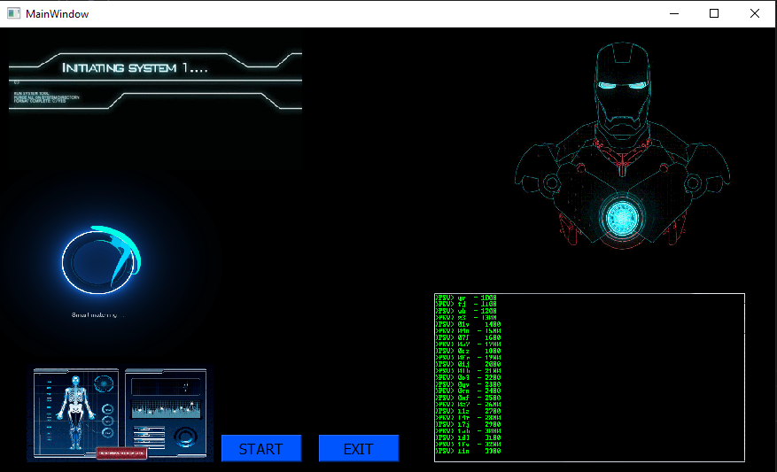
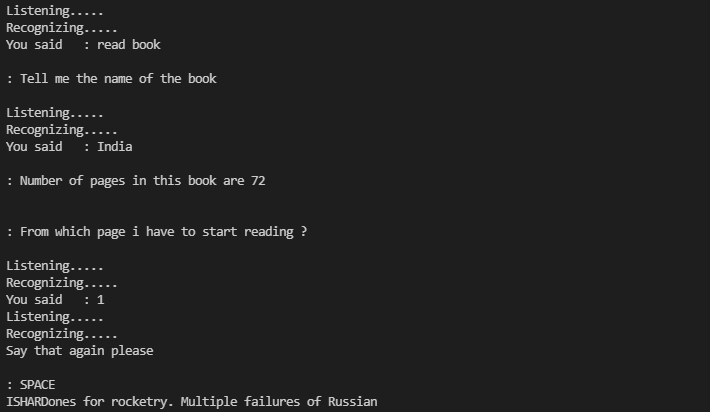

# Voice-based-Intelligent-Virtual-Assistant
<pre>Maven GUI</pre>

<pre>This Proposed project will help the elders to operate the daily functions using thier natural voice commands.To Use this Virtual Assistant the user doesn't need to learn how to operate the commands can be given just by voice.The user would just need to say "Wikipedia Animals" and the assistant will serach for the information related to animals and display it with human understable language. This would be a really helfull for the elderly people.</pre>
Following functions can be done by this virtual assistant by voice commands:-
<pre>1)Setting an Alarm</pre>

<pre>2)Current temperature and also the temperature all over the world</pre>

<pre>3)Get any information from the wikipedia</pre>

<pre>4)Current time</pre>

<pre>5)Search content on Youtube</pre>

<pre>6)Search any information on Google</pre>

<pre>7)Email to their love ones can be also use to send messages</pre>

<pre>8)Jokes</pre>

<pre>9)Hear Music</pre>

<pre>10)Simple calculations</pre>

<pre>11)rReading a book</pre>

