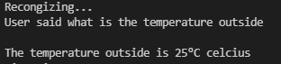

# Voice-based-Intelligent-Virtual-Assistant
This Proposed project will help the elders to operate the daily functions using thier natural voice commands.
It will make them easy to use the desktop as they can operate folowing functions given below:-
<pre>1)Setting an Alarm</pre>

<pre>2)Current temperature and also the temperature all over the world</pre>

<pre>3)Get any information from the wikipedia</pre>

<pre>4)Current time</pre>

<pre>5)Search content on Youtube</pre>

<pre>6)Search any information on Google</pre>

<pre>7)Email to their love ones can be also use to send messages</pre>

<pre>8)Jokes</pre>

<pre>9)Hear Music</pre>

